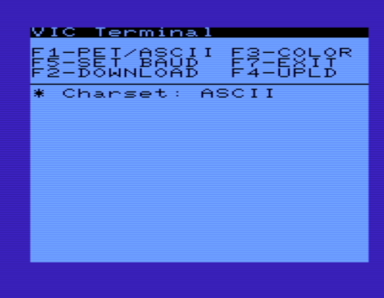

# VIC Term with Xmodem
**VICTerm** is an ASCII/PETSCII Terminal emulator for Commodore VIC-20, written in **C** so it can run at **300/600/1200 baud**. It was written initially as a just slight improvement to a BASIC demo program printed on the VIC-Modem guide, then it was ported to **C** in order to make it faster and more reliable.

It also now includes Xmodem file transfers. This only works on 8K+ expanded VIC-20s.

## Executable file
- **victerm.prg**: for *8K expanded* VIC-20s

## Improvements
- Possibility to use the **21th column** of the screen without producing a **spurious newline**. It's done implementing the cursor blinking through **KERNAL routines** instead of simulating it with BASIC instructions.
- Implemented **ASCII**/**PETSCII** modes
- In **ASCII** mode, **chr(12)** implements screen cleaning
- Possibility to connect at **300** / **600** / **1200** baud
- Beep when receiving **chr(7)**
- Toggle **B&W** / **Classic** colors
- **Xmodem** uploads and downloads

## How to compile
Run **build.sh** script. **CC65** compiler is required. It will generate one **.prg** executable file, the one mentioned above.

The executtable is included in this repo.

## Credits

Thanks to [**Francesco Sblendorio**](https://github.com/sblendorio) from whom I forked his original victerm300 program.

## Screenshot

## Original listing
This is the original program, which is printed on the VIC-Modem guide:

